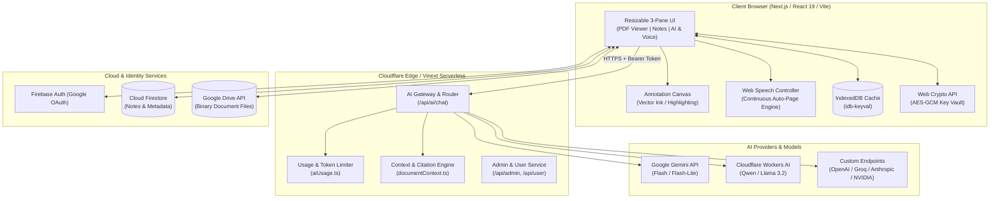

# NoteMyDoc AI (Study Assistant Application)

> **Intelligent, Multimodal AI Study Workspace & Lecture Companion**  
> Turn lecture slides, research papers, textbooks, and documents into an active, page-grounded learning experience with real-time speech-to-notes transcription, digital ink annotations, citation-backed AI reasoning, and multi-cloud synchronization.

[](https://www.typescriptlang.org/)
[](https://react.dev/)
[](https://nextjs.org/)
[](https://tailwindcss.com/)
[](https://pages.cloudflare.com/)
[](https://firebase.google.com/)
[](https://ai.google.dev/)
[]()

---

## 🌟 Overview

**NoteMyDoc AI** is an end-to-end full-stack study assistant engineered for students, researchers, and knowledge workers. Rather than treating documents as static text dumps or generic chat contexts, NoteMyDoc AI binds notes, annotations, multimodal AI intelligence, and live audio recordings directly to **individual pages and document coordinate layers**.

From automated slide-synchronized lecture dictation to deep multimodal visual reasoning and one-click printable "Study Pack" exports, the platform delivers a distraction-free, privacy-conscious, and flexible study environment.

---

## ✨ Key Features & Technical Highlights

### 1. 📄 Multimodal Document Ingestion & Optical Recognition
- **Universal Format Support**: Direct parsing and client-side rendering for **PDF** (via `react-pdf`) and **Microsoft Word DOCX** files (via `mammoth` and `docx-renderer`).
- **Scanned Document OCR**: Integrated optical character recognition using `tesseract.js` to automatically extract text layers from image-heavy lecture slides and scanned papers.
- **Hierarchical Document Indexing**: Page-by-page tokenization, document text layer extraction, and bounded coordinate mapping for fine-grained retrieval.

### 2. 🧠 Grounded Multimodal AI Assistant
- **Dual-Context Scoping**:
  - **Page Scope**: Prioritizes the active page, its extracted text, and its rendered visual canvas for immediate slide-level questions.
  - **Document Scope**: Performs semantic contextual retrieval across the entire document or custom page ranges with compact evidence payloads.
- **Multimodal Visual Reasoning**: Sends high-resolution rendered page snapshots directly to vision-capable models (e.g., Gemini 2.0 Flash / GPT-4o) for analyzing diagrams, chemical formulas, circuit schematics, and charts.
- **Verifiable Citations**: Every AI assertion is backed by numbered source references (`AISourceReference`) extracting exact quotes and page locations.
- **Interactive In-Document Citation Highlighting**: Clicking a source citation automatically navigates the PDF viewer to the relevant page and highlights the exact matching phrases—even when split across complex PDF text-layer spans.

### 3. 🎙️ Real-Time Lecture Voice Notes & Auto-Page Dictation
- **State-Machine Speech Engine**: Built on the Web Speech API with an asynchronous pipeline (`idle` → `starting` → `recording` → `finishing`).
- **Dual Recording Modes**:
  - **This Page**: Dictate personal thoughts or record an instructor's explanation for a specific slide.
  - **Auto by Page (Continuous Mode)**: As you navigate between slides during a live lecture, the system automatically segments the audio, seals the transcript chunk for the previous slide, dispatches a background AI summarization job, and begins recording for the new page without missing a syllable.
- **Resilient Background Queue**: Handled by a dedicated job controller with silence recovery, duplicate phrase deduplication, retry capabilities, and automatic block insertion into page notes.

### 4. ✍️ Digital Ink & Text Annotations Canvas
- **Direct Canvas / SVG Overlay**: A hardware-accelerated drawing overlay aligned with the document viewport across zoom levels and resizing events.
- **Precision Annotation Tools**:
  - **Pen**: Smooth vector-based freehand drawing.
  - **Highlighter**: Semi-transparent, multiply-blended strokes for marking text and diagrams.
  - **Text Annotations**: Resizable, editable text boxes placed anywhere on the slide.
  - **Eraser**: Instant stroke-level clearing.
- **Persistent Storage**: Annotations are serialized and cached in IndexedDB and synchronized with cloud storage.

### 5. 📝 Structured Block-Based Rich-Text Notes
- **Page-Scoped Notes Engine**: Separate, dedicated notebook for every single slide or page.
- **Rich Formatting & Sanitization**: HTML-based rich editor with Markdown support, styled headings, bullet points, checklists, and XSS sanitization via `DOMPurify`.
- **One-Click AI Insertion**: Transfer AI answers, definitions, formula breakdowns, or voice summaries directly into your active note blocks with clean formatting.

### 6. 🔌 Multi-Provider AI Architecture & BYOK (Bring Your Own Key)
- **Built-in Smart Routing & Fallbacks**:
  - **Google Gemini**: Gemini 2.0 Flash & Gemini 1.5/2.5 Flash Lite via secure server proxy.
  - **Cloudflare Workers AI**: Edge-hosted inference with Qwen 2.5/3, Meta Llama 3.2 3B, and Llama 3.1 8B Instruct.
- **BYOK Custom Connections**: Connect any OpenAI-compatible endpoint, Anthropic Claude, NVIDIA NIM, Groq, or Together AI.
- **Client-Side Key Encryption**: User API keys are encrypted at rest using **Web Crypto AES-GCM** before local storage, ensuring credentials never touch backend databases in plaintext.
- **Usage Governance & Token Guard**: Real-time quota calculation, rate-limiting, and tiered allowance tracking (Free vs. Pro).

### 7. 📦 One-Click "Study Pack" PDF Export
- **Comprehensive Revision Bundle**: Compile your original document pages, vector ink drawings, highlighters, rich-text page notes, voice transcripts, and AI Q&A history into a single, beautifully formatted, printable PDF study guide powered by `jspdf` and `html2canvas`.

### 8. ☁️ Local-First + Multi-Cloud Hybrid Architecture
- **Offline-First Resilience**: Instant UI responsiveness powered by IndexedDB (`idb-keyval`) caching for documents, notes, and strokes.
- **Cloud Firestore**: Real-time cross-device synchronization for document metadata, folders, notes, and stroke data.
- **Google Drive Integration**: Direct two-way OAuth2 synchronization for heavy binary documents (PDF/DOCX) using the user's personal Google Drive storage, eliminating file hosting bottlenecks.

### 9. 🖥️ Adaptive 3-Pane Interface & Study Mode
- **Resizable Tri-Panel Layout**: Powered by `react-resizable-panels` with drag handles for Document, Notes, and AI workspace.
- **Adaptive Layout Modes**: Switch between 3-pane `split`, single-pane mobile `tabs`, and `pdf-only` reading views.
- **Distraction-Free Study Mode**: True fullscreen experience with collapsible Heads-Up Display (HUD) and quick keyboard navigation.
- **Theming**: Integrated Dark and Light mode themes with system-preference detection.

### 10. 🛡️ Admin Governance & Analytics Dashboard
- Comprehensive admin portal to inspect registered user accounts, manage subscription tiers (Free/Pro), monitor platform-wide AI compute utilization, adjust token limits, and verify infrastructure health.

---

## 🏗️ Architecture & Data Flow



---

## 💻 Tech Stack

| Domain | Technologies |
| :--- | :--- |
| **Frontend Framework** | [React 19](https://react.dev/), [Next.js 16](https://nextjs.org/) App Router, [Vite 6/8](https://vitejs.dev/) via Vinext |
| **Styling & Icons** | [Tailwind CSS v4](https://tailwindcss.com/), [Lucide React](https://lucide.dev/), `@tailwindcss/typography` |
| **Document Processing** | [react-pdf](https://github.com/wojtekmaj/react-pdf), [Mammoth](https://github.com/mwilliamson/mammoth.js), [docx-renderer](https://github.com/docx-renderer), [Tesseract.js](https://tesseract.projectnaptha.com/) |
| **Layout & Interactions**| [react-resizable-panels](https://github.com/bvaughn/react-resizable-panels), [Motion](https://motion.dev/), HTML5 Canvas, Web Speech API |
| **PDF Export Engine** | [jspdf](https://github.com/parallax/jsPDF), [html2canvas](https://html2canvas.hertzen.com/) |
| **Local Storage & Security**| [idb-keyval](https://github.com/jakearchibald/idb-keyval), Web Crypto API (AES-GCM encryption), [DOMPurify](https://github.com/cure53/DOMPurify) |
| **Backend & Edge** | Next.js Edge Routes, Cloudflare Pages, Cloudflare Workers AI bindings, [Drizzle ORM](https://orm.drizzle.team/) |
| **Cloud & Authentication**| [Firebase Auth](https://firebase.google.com/docs/auth), [Cloud Firestore](https://firebase.google.com/docs/firestore), Google Drive REST API v3 |
| **AI Providers** | Google Gemini SDK, Cloudflare Workers AI, OpenAI / Groq / Anthropic / NVIDIA NIM REST API adapters |

---

## 📁 Repository Directory Structure

```text
STUDY-ASSISTANT-APPLICATION/
├── app/                        # Next.js App Router endpoints & server routes
│   ├── api/
│   │   ├── account/            # User account management & profile sync
│   │   ├── admin/              # Administrative overview & quota controls
│   │   ├── ai/                 # Unified AI inference gateway (Gemini, CF, Custom)
│   │   └── health/             # Microservice health check
│   ├── admin/page.tsx          # Dedicated admin portal UI
│   ├── globals.css             # Tailwind CSS entry & theme definitions
│   └── page.tsx                # Client app entrypoint
├── src/                        # Core application components & business logic
│   ├── components/
│   │   ├── AIAssistant.tsx     # Multimodal AI chat interface & citation panel
│   │   ├── AIConnectionsModal.tsx # BYOK modal with client-side AES-GCM encryption
│   │   ├── AnnotationCanvas.tsx# Vector pen, highlighter, eraser & text annotations
│   │   ├── Library.tsx         # Document library, folders, search, Drive sync UI
│   │   ├── NotesPanel.tsx      # Block-based rich-text notes workspace
│   │   ├── PDFViewer.tsx       # PDF / slide rendering engine with citation focus
│   │   ├── RichTextEditor.tsx  # Sanitized HTML/Markdown rich text editor
│   │   ├── StudyInterface.tsx  # Main tri-panel study workspace coordinator
│   │   ├── VoiceNotesPanel.tsx # Lecture speech transcription & background AI jobs
│   │   └── useVoiceNotes.ts    # Continuous auto-page lecture recording hook
│   ├── services/
│   │   ├── ai.ts               # Client-side AI dispatch & allowance handler
│   │   ├── auth.ts             # Firebase authentication & Google OAuth
│   │   ├── cloudData.ts        # Cloud Firestore sync for notes and metadata
│   │   ├── connectionStore.ts  # Web Crypto AES-GCM encrypted credential vault
│   │   ├── googleDrive.ts      # Direct Google Drive v3 file upload & download
│   │   ├── ocr.ts              # Tesseract.js optical character recognition
│   │   └── voiceSession.ts     # Speech recognition state machine & audio slicing
│   ├── utils/
│   │   ├── answerReferences.ts # Citation extraction & verification engine
│   │   ├── citationHighlight.ts# Cross-span PDF text-layer matching algorithm
│   │   ├── documentContext.ts  # Intelligent page token retrieval & scoping
│   │   └── pdfExport.ts        # Comprehensive Study Pack PDF generator
│   ├── App.tsx                 # Root application controller & theme manager
│   └── types.ts                # Strict TypeScript domain interfaces
├── server/                     # Server-side business logic & test suites
│   ├── accounts.ts             # User billing, plan limits & account tiers
│   ├── admin.ts                # Admin governance & usage analytics
│   ├── aiRouter.ts             # Multi-model AI router with fallback cascade
│   ├── aiUsage.ts              # Quota estimation, charging & monthly resets
│   ├── customProvider.ts       # OpenAI/Groq/NVIDIA/Anthropic streaming adapters
│   └── *.test.ts               # Unit test suites (22 tests)
├── public/                     # Static assets & PDF.js worker distribution
├── scripts/                    # Deployment & verification automation scripts
├── wrangler.jsonc              # Cloudflare Workers / Pages configuration
├── firestore.rules             # Secure granular Firestore database rules
└── package.json                # Project dependencies & operational scripts
```

---

## 🚀 Getting Started

### Prerequisites
- **Node.js**: `v20.x` or higher (Node 22 LTS recommended)
- **npm**: `v10.x` or higher
- **Firebase Project**: (For Google Sign-In and Firestore cloud synchronization)
- **Google Cloud Console Credentials**: (Optional: For Google Drive integration)
- **AI API Keys**: Google Gemini API key and/or Cloudflare Workers AI account

### 1. Clone the Repository
```bash
git clone https://github.com/shihabmuhtasim/STUDY-ASSISTANT-APPLICATION.git
cd STUDY-ASSISTANT-APPLICATION
```

### 2. Install Dependencies
```bash
npm install
```

### 3. Configure Environment Variables
Copy `.env.example` to `.env.local` and set your credentials:
```bash
cp .env.example .env.local
```

Example configuration:
```env
# Cloudflare Workers AI
CLOUDFLARE_AI_MODEL="@cf/qwen/qwen3-30b-a3b-fp8,@cf/meta/llama-3.2-3b-instruct,@cf/meta/llama-3.1-8b-instruct-fast"
CLOUDFLARE_AI_ENDPOINT=""

# Primary Hosted AI Provider (Google Gemini)
GEMINI_API_KEY="your_gemini_api_key_here"
GEMINI_MODELS="gemini-3.6-flash,gemini-3.5-flash-lite"
```

### 4. Run Development Server
```bash
npm run dev
```
Open [http://localhost:3000](http://localhost:3000) in your browser.

---

## 🧪 Testing

The repository includes a comprehensive unit and integration test suite covering AI token usage calculations, citation matching algorithms, context slicing, and speech recognition state machines:

```bash
npm test
```

Test coverage includes:
- `aiUsage.test.ts`: Quota calculation, compute limits, fallback charging, monthly reset dates.
- `answerReferences.test.ts`: Verification of parsed AI references against actual citations.
- `citationHighlight.test.ts`: Exact phrase matching across split DOM elements in PDF text layers.
- `documentContext.test.ts`: Multi-page contextual retrieval, page ranges, and token pruning.
- `voiceSession.test.ts`: Speech recognition state transitions, page change auto-segmentation, and silence recovery.

---

## 🚢 Deployment

### Deploying to Cloudflare Pages
NoteMyDoc AI is optimized for deployment on Cloudflare Pages with edge SSR:

```bash
# Build and prepare production bundle
npm run build
npm run prepare:pages

# Deploy to Cloudflare Pages via Wrangler
npm run deploy:pages
```

---

## 🔒 Security & Privacy

- **Client-Side Encryption (BYOK)**: Any custom API key configured by the user is encrypted in the browser using the Web Crypto API (`AES-GCM` with a PBKDF2-derived key) before being stored.
- **Secure Server-Side AI Gateway**: Hosted API keys (e.g. Gemini) remain strictly on the backend and are never exposed to the client bundle.
- **Data Ownership**: Large documents can be synchronized directly to the user's personal Google Drive account through granular OAuth scopes, ensuring sensitive course materials or research documents are never held hostage on third-party servers.
- **HTML Sanitization**: All rich text notes, AI output, and voice transcripts pass through strict `DOMPurify` rules prior to rendering.

---

## 📄 License

This project is licensed under the Apache License, Version 2.0. See the `LICENSE` file for more details.
